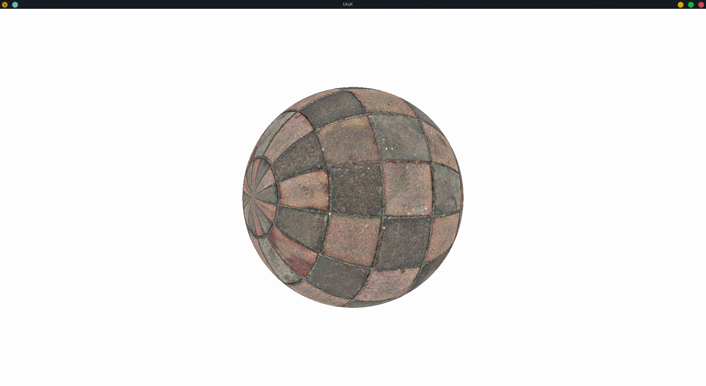

## 简介

计算机图形学的OpenGL实验，使用core-profile mode.

共有7个实验：

1. 线段的光栅化：使用中点法
2. 圆的光栅化：使用中点法
3. 多边形填充：使用4-邻接的种子填充法
4. 直线的裁剪：使用Liang-Barsky算法
5. 2D变换
6. 3D变换
7. 纹理映射

[src/](./src)中每个文件夹内有x86_64的Linux下编译好的程序`main`，`main`执行的截图也放在文件夹中.

除了OpenGL库外，还使用了其他库：

- **context creation:** [GLFW](https://github.com/glfw/glfw)
- **function loading:** [glbinding](https://github.com/cginternals/glbinding)

## 目录结构

- `src/`代码
- `report/` 实验报告

## 一些截图

全部截图可见[src/](./src)中每个文件夹内的图片；x86_64的Linux下可运行的程序`main`也在[各个文件夹](./src)中.

